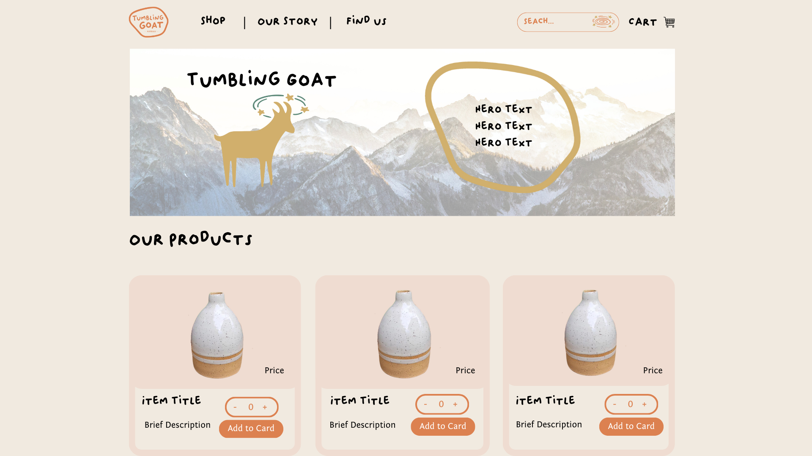
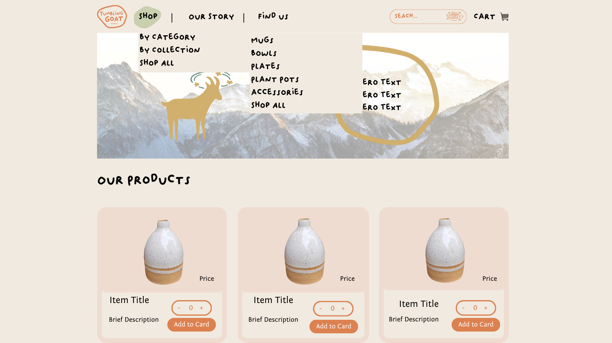
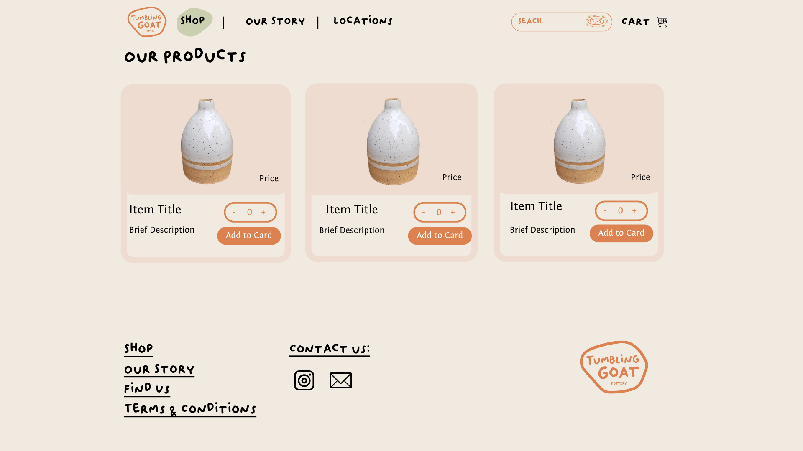
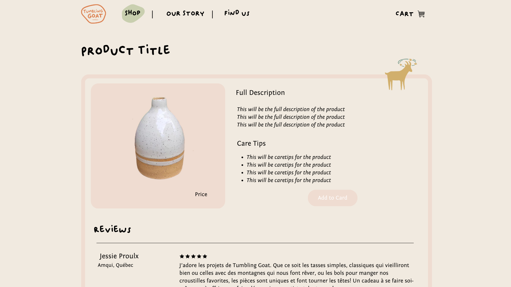
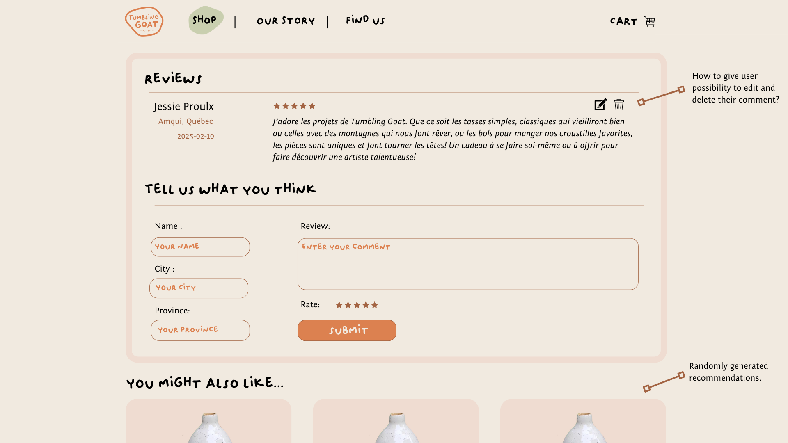
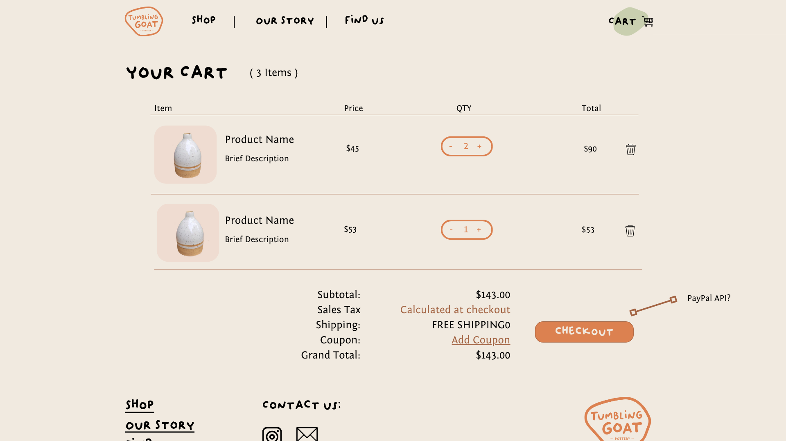
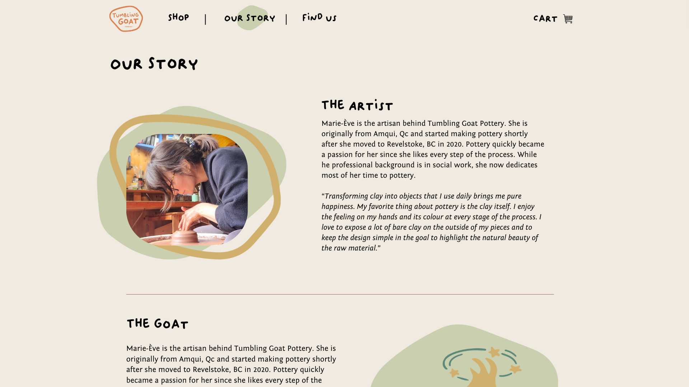
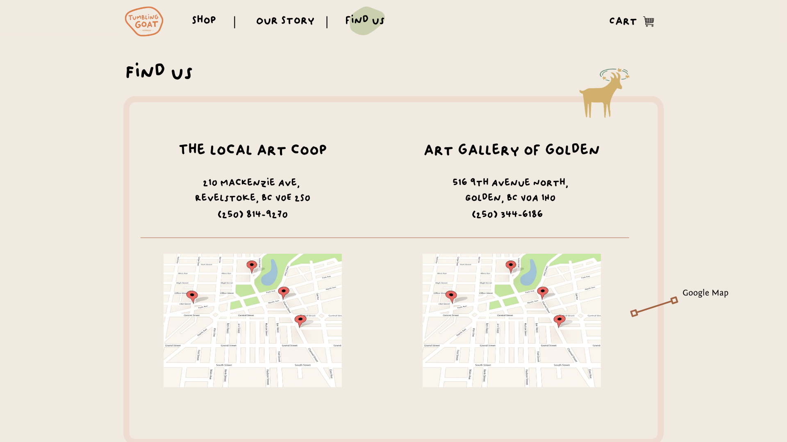

# Project Title

Tumbling Goat

## Overview

The Tumbling Goat provides pottery artists with a digital platform to connect with customers, market their products, and share details about events and selling locations. By streamlining marketing and sales efforts, the app empowers artists to focus on their craft while reaching a broader, more engaged audience.

### Problem Space

Pottery artists invest countless hours creating their unique pieces, but reaching customers and selling their work remains a significant challenge. Many rely on local markets, which often result in unpredictable sales and difficulty in planning inventory. This lack of stability and limited visibility can hinder their growth and artistic endeavors.

### User Profile

Pottery Artists: Independent artists and small pottery business owners seeking to expand their customer base, promote events, and streamline product sales.
Art Enthusiasts & Shoppers: Individuals interested in discovering unique, handmade pottery and supporting local artists.

### Features

List the functionality that your app will include. These can be written as user stories or descriptions with related details. Do not describe _how_ these features are implemented, only _what_ needs to be implemented.

- As a user, I want to be able to look for items on the main page and search for keywords.
- As a user, I want to be able to sort all the items according to categories and collections.
- As a user, I want to be able to access more details on a specific item when I click on it.
- As a user, I want to be able to add an item to my cart and select the quantity.

- As a user, I want to be able to be able to read and add a review on a specific item.
- As a user, I want to be able to edit or delete my comment.

- As a user, I want to see all the details of my order in my cart and be able to edit quantities or remove items from my order.

- As a user, I want to be able to easily find the locations where the artist sells their art.
- As a user, I want to be able to contact the artist and learn more about them.

## Implementation

### Tech Stack

- React
- Express
- Client Libraries:
  - react
  - react-router
  - axios
- Server Libraries
  - express

### APIs

- Google API

### Sitemap

- Home Page
- Product Page
- Cart Page
- Find Us Page
- Our Story Page

### Mockups

#### Home Page





#### Product Page




#### Cart Page



#### Our Story Page



#### Find Us Page



### Data

Product Object :

```
 {
    "id": "1",
    "name": "Coffee Mug - Begbie",
    "photo": "begbie_mug.jpg",
    "price": "$45",
    "stock": 8,
    "category": "Mug",
    "collection": "Begbie Collection",
    "brief-description":
      "A beautifully handcrafted coffee mug inspired by the majestic Mount Begbie in Revelstoke, BC.",
    "full-description":
      "Embrace the rugged beauty of the outdoors with this earthy, artisan-crafted mug. The design draws inspiration from the textured landscape and natural tones of Begbie Mountain, making it both a visual and tactile delight. With its sturdy form and comfortable grip, this mug is perfect for savoring your morning coffee or afternoon tea. A true piece of craftsmanship that brings the essence of nature to your daily routine.",
    "care-tips": [
      {
        "id": "1",
        "tip": "Hand wash only to preserve the unique glaze and finish."
      },
      {
        "id": "2",
        "tip":  "Not dishwasher safe."
      },
      {
        "id": "3",
        "tip":  "Avoid sudden temperature changes, such as pouring boiling liquids into a cold mug."
      },
      {
        "id": "4",
        "tip": "Use a soft sponge and mild detergent for cleaning."
      }
    ],
    reviews: [
      {
        "id": "1",
        "name": "Jessie Proulx",
        "city": "Amqui",
        "province": "Quebec",
        "review": "This is Jessie's review",
        "rate": "5"
      },
      {
        "id": "2",
        "name": "John Doe",
        "city": "Revelstoke",
        "province": "Brisish Columbia",
        "review": "This is John's review",
        "rate": "4"
      }
    ],
    tags: [
      {
        "id": "1"
        "tag": "handmade"
      },
      {
        "id": "2"
        "tag": "begbie"
      },
       {
        "id": "3"
        "tag": "revelstoke"
      }
      ],
  }
```

### Endpoints

**GET /products**

- Get full list of products for home page

Response:

```
[{
  "id": "1",
  "name": "Coffee Mug - Begbie",
  "photo": "begbie_mug.jpg",
  "price": "$45",
    "stock": 8,
    "category": "Mug",
    "collection": "Begbie Collection",
    "brief-description":
      "A beautifully handcrafted coffee mug inspired by the majestic Mount Begbie in Revelstoke, BC.",
}]
```

**GET /products/:id**

- Get individual product details for Product Page

Parameters:

- id: Product id as a number

Response

```
 {
    "id": "1",
    "name": "Coffee Mug - Begbie",
    "photo": "begbie_mug.jpg",
    "price": "$45",
    "stock": 8,
    "category": "Mug",
    "collection": "Begbie Collection",
    "brief-description":
      "A beautifully handcrafted coffee mug inspired by the majestic Mount Begbie in Revelstoke, BC.",
    "full-description":
      "Embrace the rugged beauty of the outdoors with this earthy, artisan-crafted mug. The design draws inspiration from the textured landscape and natural tones of Begbie Mountain, making it both a visual and tactile delight. With its sturdy form and comfortable grip, this mug is perfect for savoring your morning coffee or afternoon tea. A true piece of craftsmanship that brings the essence of nature to your daily routine.",
    "care-tips": [
      {
        "id": "1",
        "tip": "Hand wash only to preserve the unique glaze and finish."
      },
      {
        "id": "2",
        "tip":  "Not dishwasher safe."
      },
      {
        "id": "3",
        "tip":  "Avoid sudden temperature changes, such as pouring boiling liquids into a cold mug."
      },
      {
        "id": "4",
        "tip": "Use a soft sponge and mild detergent for cleaning."
      }
    ],
    "reviews": [
      {
        "id": "1",
        "name": "Jessie Proulx",
        "city": "Amqui",
        "province": "Quebec",
        "review": "This is Jessie's review",
        "rate": "5"
      },
      {
        "id": "2",
        "name": "John Doe",
        "city": "Revelstoke",
        "province": "Brisish Columbia",
        "review": "This is John's review",
        "rate": "4"
      }
    ],
    "tags": [
      {
        "id": "1"
        "tag": "handmade"
      },
      {
        "id": "2"
        "tag": "begbie"
      },
       {
        "id": "3"
        "tag": "revelstoke"
      }
      ],
  }
```

**GET /products/:id/reviews**

Response:

```
  "id": "1",
  "name": "Coffee Mug - Begbie",
  "reviews": [
      {
        "id": "1",
        "name": "Jessie Proulx",
        "city": "Amqui",
        "province": "Quebec",
        "review": "This is Jessie's review",
        "rate": "5"
      },
      {
        "id": "2",
        "name": "John Doe",
        "city": "Revelstoke",
        "province": "Brisish Columbia",
        "review": "This is John's review",
        "rate": "4"
      }
    ],
```

**POST /products/:id/reviews**

- Post review on product page

Parameters: 
- id: Product id as a number

Response:
```
{
        "id": "2",
        "name": "John Doe",
        "city": "Revelstoke",
        "province": "Brisish Columbia",
        "review": "This is John's review",
        "rate": "4"
      }
```

**PUT /products/:id/reviews/:id**

- Edit a comment after posting.

Parameters: 
- id: Product id and review id as a number 

Response: 
```
{
        "id": "2",
        "name": "John Doe",
        "city": "Revelstoke",
        "province": "Brisish Columbia",
        "review": "This is John's review",
        "rate": "4"
      }
```

**DELETE /products/:id/reviews/:id**

- Delete a review after posting it. 

Parameters: 
- id: Product id and review id as a number 
```
{
      }
```

## Roadmap

- Create client (1)
    - react project with routes and boilerplate pages

- Create server (1)
    - express project with routing, with placeholder 200 responses

- Create product objects for 10-15 items (2)

- Create partials (global, mixins, variables, typography) (1)

- Front-end: Create all routes for all pages (2)

- Front-end: Create Header Component(Responsive) (5)

- Front-end: Create Footer Component(Responsive) (2)

- Back-end: GET all products (1)

- Front-end: Create HomePage (Hero, Our Products) (8)

- Front-end: Search functionalities (category, name, collection) - add to header. (3)

- Back-end: GET Product by ID (1)

- Back-end: GET Reviews for a given product (1)

- Back-end: POST Review for a given product (1)

- Back-end: PUT Review for a given product(1)

- Back-end: DELETE Review for a given product (1)

- Front-end: Create Product Page (8)

- Front-end: Create About Us Page - explore animations. (5)

- Front-end: Create Find Us Page - Google API for maps. (5)

- Pre-launch: Project wide Testing (3)

---

## Future Implementations

- User Authentication
- Payment Options (CC, Paypal, Apple Pay)
- Create Terms & Conditions Page
- Create Event Page
    - Share to social
    - Add to my calendar
